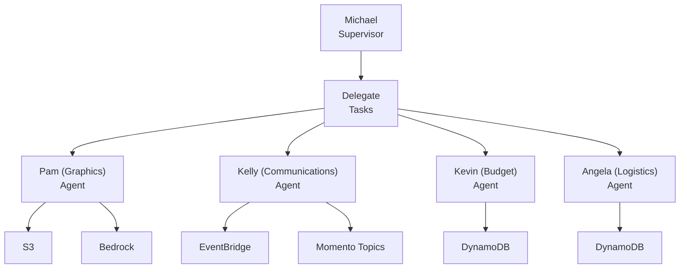

# Multi-Agent Party Planning System

This project demonstrates multi-agent collaboration using Amazon Bedrock Agents, showcasing how multiple AI agents can work together to accomplish a complex task - in this case, planning an office party.

## Overview

The system implements a hierarchical structure of AI agents, each with specialized roles and responsibilities. Each agent has specific IAM roles and permissions, dedicated Lambda functions for their tasks, access to relevant data stores, and custom instructions defining their personality and role.



### Michael (Supervisor Agent)
- Office manager who oversees the party planning process
- Delegates tasks to specialized agents and coordinates their efforts
- Makes final approvals on plans and budgets

### Supporting Agents

**Kevin (Budget Agent)**
- Manages and tracks party budgets
- Ensures costs stay within annual spending limits
- Approves or rejects proposed expenditures
- Maintains historical spending records in DynamoDB

**Pam (Graphics Agent)**
- Creates party-themed graphics using Bedrock's image generation
- Estimates costs for printing and materials
- Generates and stores graphics in S3

**Kelly (Communications Agent)**
- Handles all party-related communications
- Crafts and sends emails using HTML templates
- Manages internal messaging through Momento cache
- Ensures proper timing of announcements

**Angela (Logistics Agent)**
- Coordinates venue, date, and time
- Manages inventory and equipment needs
- Sources rentals and tracks costs
- Maintains logistics data in DynamoDB

## How it works

1. The supervisor agent (Michael) receives party planning requests
2. Michael delegates specific tasks to each specialized agent:
   - Pam creates promotional graphics
   - Angela determines logistics and costs
   - Kevin reviews and approves budgets
   - Kelly handles announcements
3. Agents communicate through internal channels and store data in respective databases
4. Michael coordinates between agents and makes final decisions

## Deployment

1. Prerequisites:
   - AWS CLI configured with appropriate permissions
   - SAM CLI installed
   - Node.js 18+ installed
   - Momento API key
   - A Momento cache name

2. Deploy the stack:
```bash
sam build
sam deploy --guided
```
During guided deployment, you'll need to provide:

* Momento API key ([get one here](https://console.gomomento.com/api-keys))
* Momento cache name ([create one here](https://console.gomomento.com/caches/create))

*Note - The Momento pieces are for the internal communication features for one of the agents. You can leave those blank if you don't want that functionality.*

The deployment will create all necessary resources and configure the agents for collaboration.

## Usage

To plan your parties, you can go to the Amazon Bedrock console in AWS and open up the *Michael* agent. Ask him to plan a party with whatever theme you'd like and watch the orchestration unfold!
